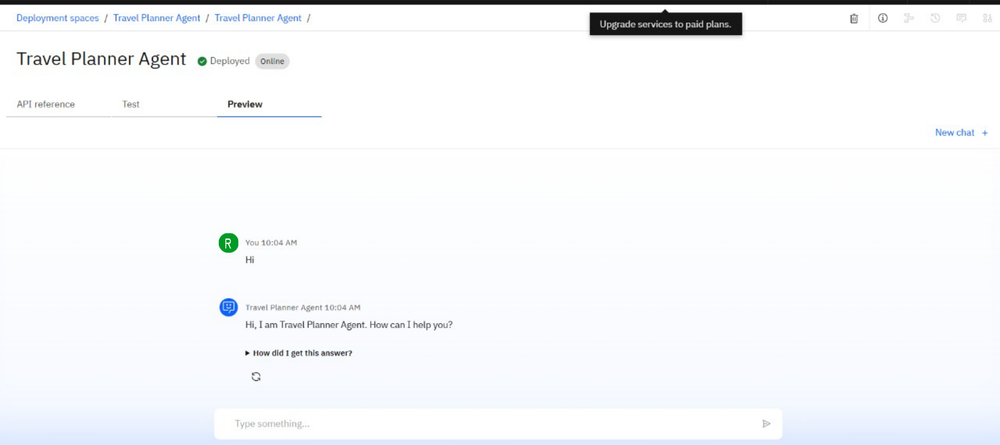

# Travel-Planner-Agent
Travel Planner Agent is an AI assistant that plans trips for You
# 🌍 AI Travel Planner Agent

The **AI Travel Planner Agent** is a smart assistant built using **IBM Watsonx.ai** that helps users plan personalized trips.  
It suggests destinations, itineraries, accommodations, and activities based on user preferences such as budget, duration, interests, and travel style.  

---

## ✨ Features
- 🛫 Destination recommendations tailored to budget & season  
- 🏨 Hotel and accommodation suggestions  
- 🎟 Activity and sightseeing itinerary generation  
- ⏱ Optimized travel schedule (day-wise plan)  
- 🍽 Food and local cultural experience recommendations  
- 🌍 Multi-language support for global travelers  

---

## 🏗 Technology Stack
- **IBM Watsonx.ai Studio**  
- **IBM Cloud Runtime Deployment**  
- **Granite NLP Models**  
- Retrieval-Augmented Generation (RAG) for travel databases  
- Python / Curl API Integration  

---

## 🚀 Deployment
The AI agent is deployed on **IBM Watsonx.ai** as an online endpoint.  

- **Endpoint**: https://us-south.ml.cloud.ibm.com/ml/v4/deployments/0ce777e8-6933-414e-80c0-d331b2b79f32/ai_service?version=2021-05-01  
- **Authentication**: Requires IBM Cloud API Key & IAM Token  

---

## 📌 Example Usage

### Python Example
```python
import requests

url = ('https://us-south.ml.cloud.ibm.com/ml/v4/deployments/0ce777e8-6933-414e-80c0-d331b2b79f32/ai_service_stream?version=2021-05-01', json=payload_scoring,
 headers={'Authorization': 'Bearer ' + mltoken})
headers = {
    "Authorization": "Bearer <your-ibm-iam-token>",
    "Content-Type": "application/json"
}

data = {
    "input_data": [
        {"fields": ["preferences"], "values": ["3 days, budget travel, beach destination, adventure activities"]}
    ]
}

response = requests.post(url, json=data, headers=headers)
print(response.json())
```

### Curl Example
```bash
curl -X POST "https://us-south.ml.cloud.ibm.com/ml/v4/deployments/0ce777e8-6933-414e-80c0-d331b2b79f32/ai_service_stream?version=2021-05-01" \
--header "Authorization: Bearer <your-ibm-iam-token>" \
--header "Content-Type: application/json" \
--data '{"input_data":[{"fields":["preferences"],"values":["5 days, luxury travel, Europe, cultural experiences"]}]}'
```

---

## 🖼 Deployment Screenshot


---

## 🧳 Example Output
**Input:** "Plan a 4-day budget trip to Goa with beaches and adventure"  
**Output:**  
- Suggested Itinerary:  
  - **Day 1:** Arrival & beach relaxation (Baga/Calangute)  
  - **Day 2:** Water sports & local market visit  
  - **Day 3:** Island trip & cultural food tour  
  - **Day 4:** Souvenir shopping & departure  
- Accommodation: Budget hotels near Baga Beach  
- Estimated Cost: ₹18,000 – ₹22,000  

---

## 📌 Future Scope
- Real-time flight & hotel API integration  
- Travel insurance recommendations  
- Group itinerary planning  
- Voice-enabled assistant for travel planning  

---

## 👨‍💻 Author
Developed by **Rajdeep Roy** using IBM Watsonx.ai Studio.  
